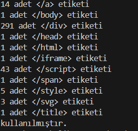

# 🕸️ Web Sitesi Kod Analiz Programı (Web Code Analyzer)

Bu proje, **Python** kullanılarak geliştirilmiş, belirtilen bir web sitesinin kaynak kodlarını tarayarak yapısal analiz yapan ve temel SEO verilerini çıkaran bir araçtır.

## 📋 Proje Hakkında

Web geliştirmede veya veri analizinde, bir sayfanın iskeletini hızlıca anlamak önemlidir. Bu script, kullanıcıdan bir URL alır, o siteye bir istek (request) gönderir ve dönen HTML verisini ayrıştırarak (parsing) özet bilgiler sunar. Özellikle rakip analizi veya hızlı SEO kontrolü için kullanışlıdır.

### 🚀 Özellikler

Script, verilen URL üzerinde analizler yapar ve hangi etiketin kaç kez kullanıldığını tespit eder.

## 🛠️ Teknolojiler ve Kütüphaneler

Bu proje **Python 3** ile geliştirilmiştir ve aşağıdaki harici kütüphaneleri kullanır:

* **Requests:** Web sitelerine HTTP istekleri göndermek için.

